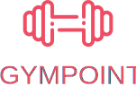

<h1 align="center">
 
  
 
 
Gympoint - frontend
</h1>

An app for gym management.

  

## Features

This app features all the latest tools and practices in web development!

- ⚛ **React** — A library to build user interfaces
- ♻ **Redux with Redux Saga** — State management with middleware
- 💅 **CSS** — styled-components
- 🌸 **Reactotron** - Helps debugging process
- 💖 **Lint** — ESlint/Prettier/Editor Config

## Getting started

_Before you run this application you need to make sure the [server](https://github.com/gustavonobrega/backend-gympoint.git) is running!_.

1. Clone this repo using `https://github.com/gustavonobrega/frontend-gympoint.git`
2. Move to the appropriate directory: `cd frontend-gympoint`. 
3. Run `yarn` to install dependencies. 
4. Run `yarn start` to see the example app at `http://localhost:3000`.
